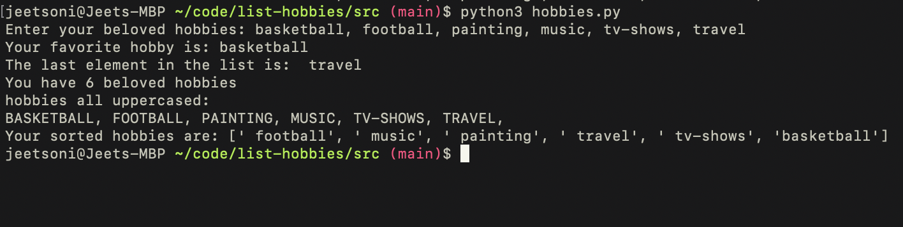

# Hobbies List
*Author: Jeet Soni*

*Date: 08/12/2023*

### **Write a python script to ask users for comma separated hobbies. Store users' provided value in a data structure.**
 
- print the first hobby
- print the last hobby 
- print length of the data structure 
- upper case all hobbies and print them 
- sort the data structure and print it

To print the first hobby, I used list position to print out the first element in the list.

To print the last hobby, I used a for loop to reverse the list and then print the first element in the list. I broke the for loop after making it print once. 

To print the length, I simply used len() function to print the length of the data structure.

To print all uppercase hobbies, I used upper() function to uppercase all the items in the list.

To sort the data structure, first did list.sort() and then I simply printed the list to get the sorted list. 

### **My hobbies**

### **Conclusion**

I learned so much about how to work with lists and how to use its method. I enjoyed working with the lists.

Enjoy :)